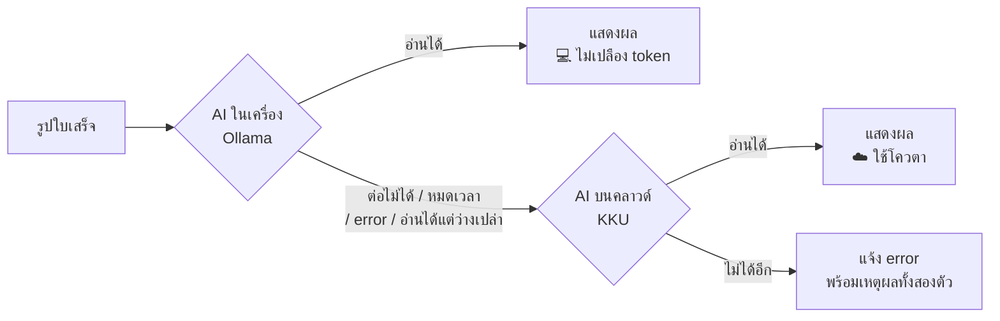

# Bill ORC — สรุปโปรเจกต์

เอกสารสรุปสิ่งที่สร้างขึ้นทั้งหมด สำหรับทบทวนภายหลังหรือส่งต่อให้คนอื่นอ่าน

| | |
|---|---|
| **ชื่อโปรเจกต์** | Bill ORC — ระบบบันทึกใบเสร็จและบัญชีร้านค้า |
| **เว็บไซต์** | https://bill-orc.vercel.app |
| **โค้ด** | https://github.com/Natthawat-Duangkhamjan7729/Bill-ORC |
| **ขนาด** | 26 commits · 50 ไฟล์ · ~3,760 บรรทัด (TypeScript/SQL) |
| **สถานะ** | ใช้งานได้จริง ออนไลน์แล้ว |

---

## 1. โปรเจกต์นี้ทำอะไร

แอปช่วยเจ้าของร้านค้าจัดการบัญชี โดยแก้ปัญหาที่น่าเบื่อที่สุดคือ**การพิมพ์ข้อมูลจากใบเสร็จ** — ถ่ายรูปใบเสร็จ แล้ว AI อ่านข้อมูลออกมาให้อัตโนมัติ ทั้งชื่อร้าน วันที่ รายการสินค้า ราคา และยอดรวม

จากนั้นแอปเอาข้อมูลนั้นมาต่อยอด: บันทึกยอดขายควบคู่ → คำนวณกำไร-ขาดทุนรายเดือน → แยกดูว่าเงินไปลงหมวดไหน → ส่งออกเป็น Excel ให้บัญชีหรือใช้ทำภาษี

**กลุ่มเป้าหมาย:** เจ้าของร้านค้ารายย่อยที่จดบัญชีเอง ไม่มีระบบ POS ราคาแพง

---

## 2. เทคโนโลยีที่ใช้

| ส่วน | เทคโนโลยี | เหตุผลที่เลือก |
|---|---|---|
| เว็บเฟรมเวิร์ก | **Next.js 16** (App Router) | เขียนหน้าเว็บและ API ในโปรเจกต์เดียว deploy ง่าย |
| ภาษา | **TypeScript** | จับ bug ตั้งแต่ตอนเขียน ไม่ต้องรอเจอตอนใช้งานจริง |
| หน้าตา | **Tailwind CSS** | เขียนสไตล์เร็ว ไม่ต้องสลับไฟล์ไปมา |
| ฐานข้อมูล | **Supabase** (PostgreSQL) | ได้ทั้งฐานข้อมูล ระบบล็อกอิน และที่เก็บรูป ในที่เดียว มี free tier |
| ระบบล็อกอิน | **Supabase Auth** | อีเมล/รหัสผ่าน จัดการ session ผ่าน cookie ให้เอง |
| ที่เก็บรูป | **Supabase Storage** | bucket แบบ private เข้าถึงผ่านลิงก์ชั่วคราวเท่านั้น |
| AI อ่านใบเสร็จ | **OpenAI-compatible API** | ไม่ผูกกับเจ้าใดเจ้าหนึ่ง สลับระหว่าง AI ในเครื่องกับคลาวด์ได้ |
| โฮสติ้ง | **Vercel** | ต่อกับ GitHub push แล้ว deploy อัตโนมัติ |

---

## 3. ฟีเจอร์ทั้งหมด

### 3.1 สแกนใบเสร็จด้วย AI
- ถ่ายรูปหรือเลือกไฟล์ **ได้หลายใบพร้อมกัน**
- AI อ่านทีละใบเป็นคิว **อ่านไปตรวจไป** — ใบแรกเสร็จก็เปิดฟอร์มให้ตรวจเลย ไม่ต้องรอครบ
- แถบรูปย่อบอกสถานะทุกใบ: รอคิว → กำลังอ่าน → พร้อมตรวจ → บันทึกแล้ว
- ใบไหนอ่านพลาด เลือกได้ 3 ทาง: **ลองอีกครั้ง / กรอกเอง / ข้ามใบนี้** — ใบเสียใบเดียวไม่ล้มทั้งคิว
- ระบบลองซ้ำให้อัตโนมัติ 1 ครั้งก่อนแจ้ง error
- รูปถูกย่ออัตโนมัติก่อนอัปโหลด (เก็บที่ 1100px คุณภาพ 70% ≈ 100–150 KB/ใบ)

### 3.2 AI ในเครื่อง + สำรองบนคลาวด์
ประหยัดโควตา API โดยให้ AI ที่รันบนเครื่องตัวเองอ่านก่อน แล้วค่อยพึ่งคลาวด์เฉพาะใบที่อ่านไม่ออก



- เงื่อนไขสลับไปคลาวด์: ต่อไม่ได้ / หมดเวลา / เซิร์ฟเวอร์ error / **อ่านได้แต่ไม่เจอทั้งยอดและรายการ**
- เงื่อนไขสุดท้ายสำคัญที่สุด — เป็นอาการปกติของโมเดลเล็กเจอบิลลายมือ
- หน้าเว็บบอกทุกครั้งว่าใบนั้นใครอ่าน (💻 ในเครื่อง / ☁️ คลาวด์)
- ตั้งค่าผ่าน environment variable ล้วน ไม่ต้องแก้โค้ด

**โมเดลแนะนำสำหรับการ์ดจอ 6 GB:** `qwen2.5vl:7b` (แม่นสุดที่ยัดลงได้) → `gemma3:4b` (เร็วกว่า) → `qwen2.5vl:3b` (เร็วสุด)

### 3.3 จัดการใบเสร็จ
- แก้ไขทุกอย่างได้หลังบันทึก — ชื่อร้าน วันที่ หมวดหมู่ รายการสินค้า ยอดเงิน
- ค้นหาตามชื่อร้าน + กรองตามช่วงวันที่ (ฟิลเตอร์อยู่ใน URL แชร์ลิงก์ได้ กดย้อนกลับได้)
- ดูรูปใบเสร็จต้นฉบับได้ตลอด
- ลบใบเสร็จพร้อมรูปในที่เก็บ

### 3.4 หมวดหมู่รายจ่าย
AI เดาหมวดให้อัตโนมัติตอนสแกน จาก 6 หมวด: **วัตถุดิบ / ค่าน้ำ-ค่าไฟ / อุปกรณ์ / ค่าขนส่ง / ค่าเช่า / อื่น ๆ** (แก้เองได้ก่อนบันทึก) แล้วเอาไปทำกราฟ "เงินไปลงตรงไหน"

### 3.5 บันทึกยอดขาย
- ฟอร์มกรอกเร็ว วันที่ default เป็นวันนี้ → เคสปกติคือกรอกยอด + กดบันทึก จบ
- แยกช่องทาง: เงินสด / โอน / เดลิเวอรี่ / อื่น ๆ
- บันทึกหลายรายการต่อวันได้

### 3.6 กำไร-ขาดทุน
- การ์ดสรุป: รายรับ / รายจ่าย / กำไรเดือนนี้ (ติดลบขึ้นสีแดงอัตโนมัติ)
- กราฟแท่งคู่ 12 เดือน เขียว = รายรับ ส้ม = รายจ่าย
- ตารางรายเดือนพร้อมกำไรแต่ละเดือน

### 3.7 หน้าภาพรวม (Dashboard)
- การ์ด KPI 4 ใบ: รายรับ / รายจ่าย / กำไร / จำนวนใบเสร็จ
- กราฟรายรับ-รายจ่าย 6 เดือน (ชี้ที่แท่งเห็นตัวเลขทั้งหมด)
- โดนัทสัดส่วนเดือนนี้ พร้อมกำไรตรงกลาง
- อันดับรายจ่ายตามหมวด + ใบเสร็จล่าสุด 5 ใบ

### 3.8 ส่งออก Excel
- **ใบเสร็จ CSV** — 1 แถวต่อใบ (เอาไป SUM ต่อได้ไม่ซ้ำซ้อน)
- **รายสินค้า CSV** — 1 แถวต่อรายการ สำหรับดูต้นทุนละเอียด
- หัวคอลัมน์ภาษาไทย + ใส่ BOM เปิดใน Excel ไม่เป็นภาษาต่างดาว
- ไฟล์ที่ได้ตรงกับฟิลเตอร์ที่กรองอยู่ ("เห็นอะไร ได้อันนั้น")

### 3.9 ใช้บนมือถือ
- Sidebar บนจอคอม / แถบแท็บล่างบนมือถือ (นิ้วโป้งถึงง่าย)
- ติดตั้งเป็นแอปบนหน้าจอโฮมได้ (PWA)
- บังคับธีมสว่างทั้งแอป กันตัวหนังสือหายบนเครื่องที่เปิด dark mode

---

## 4. โครงสร้างโปรเจกต์

```
app/
├── page.tsx                    หน้าแรก (ล็อกอินแล้วเด้งเข้า dashboard)
├── login/                      เข้าสู่ระบบ / สมัคร
├── dashboard/                  ภาพรวม — KPI + กราฟ + ใบเสร็จล่าสุด
├── receipts/
│   ├── page.tsx                รายการใบเสร็จ + ค้นหา + export
│   └── [id]/                   รายละเอียด + แก้ไข + ลบ
├── upload/                     สแกนใบเสร็จ (คิวหลายใบ)
├── sales/                      บันทึกยอดขาย
├── profit/                     กำไร-ขาดทุน
├── summary/                    สรุปรายจ่าย
└── api/
    ├── ocr/route.ts            เรียก AI อ่านใบเสร็จ
    └── export/route.ts         สร้างไฟล์ CSV

components/
├── app-shell.tsx               โครงหน้าเว็บ (sidebar + แถบล่าง)
├── nav.tsx                     เมนู
├── charts.tsx                  กราฟทั้งหมด (แท่ง โดนัท อันดับ การ์ด KPI)
└── receipt-form.tsx            ฟอร์มใบเสร็จ (ใช้ทั้งตอนสร้างและแก้ไข)

lib/
├── ocr.ts                      ตรรกะเลือก AI + ระบบสำรอง
├── ocr.test.mts                เทส 17 เคส (npm run test:ocr)
├── image.ts                    ย่อรูปก่อนส่ง/เก็บ
├── categories.ts               รายชื่อหมวดหมู่
├── viz.ts                      สีกราฟ + ฟอร์แมตเงินบาท
├── types.ts                    โครงสร้างข้อมูลใบเสร็จ
└── supabase/                   การเชื่อมต่อฐานข้อมูล

supabase/schema.sql             โครงฐานข้อมูล + กฎความปลอดภัย
proxy.ts                        ตรวจ session + กันหน้าที่ต้องล็อกอิน
```

---

## 5. ฐานข้อมูลและความปลอดภัย

### ตาราง

| ตาราง | เก็บอะไร | ฟิลด์สำคัญ |
|---|---|---|
| `receipts` | ใบเสร็จซื้อของ | ชื่อร้าน, วันที่, หมวดหมู่, ยอดก่อนภาษี, ภาษี, ยอดรวม, พาธรูป |
| `receipt_items` | รายการสินค้าในใบเสร็จ | ชื่อสินค้า, จำนวน, ราคาต่อหน่วย, ราคารวม |
| `sales` | ยอดขายรายวัน | วันที่, จำนวนเงิน, ช่องทาง, โน้ต |

### ความปลอดภัย

1. **Row Level Security** — ทุกตารางมีกฎที่ฐานข้อมูลบังคับว่าผู้ใช้เห็นเฉพาะข้อมูลตัวเอง ต่อให้โค้ดหน้าเว็บพลาด ฐานข้อมูลก็ยังไม่ยอมส่งข้อมูลคนอื่นออกไป
2. **Storage แบบ private** — รูปเก็บในโฟลเดอร์แยกตาม user id เข้าถึงผ่านลิงก์ชั่วคราวอายุ 1 ชั่วโมงเท่านั้น ไม่มี URL สาธารณะ
3. **API ต้องล็อกอิน** — endpoint ที่ใช้โควตา AI ตรวจ session ก่อนทุกครั้ง
4. **คีย์ไม่ขึ้น Git** — `.env.local` ถูก ignore ไว้ ใน repo มีแค่ `.env.example` ที่เป็นแม่แบบ

---

## 6. ปัญหาที่เจอระหว่างทาง และวิธีแก้

ส่วนนี้น่าจะมีประโยชน์ที่สุดถ้าต้องกลับมาดูภายหลัง

| # | อาการ | สาเหตุจริง | วิธีแก้ |
|---|---|---|---|
| 1 | ตัวหนังสืออ่านไม่ออกบนมือถือ | เครื่องเปิด dark mode แล้วเบราว์เซอร์สลับสีให้เอง | บังคับ `color-scheme: light` + กำหนดพื้นขาวตัวหนังสือเข้มชัดเจน |
| 2 | อัปเกรด Next.js 14 → 16 พัง | API เปลี่ยน: cookies เป็น async, params เป็น Promise, middleware เปลี่ยนชื่อเป็น proxy, ESLint เปลี่ยนรูปแบบ config | แก้ตามทีละจุด |
| 3 | Vercel deploy โค้ดเก่า | Production Branch ตั้งไว้ที่ `main` แต่โค้ดอยู่อีก branch | เปลี่ยน Production Branch ใน Vercel |
| 4 | `The string did not match the expected pattern` | **บัค Safari บนมือถือ** — ส่ง base64 ก้อนใหญ่เป็น JSON แล้วพังตั้งแต่ก่อนถึงเซิร์ฟเวอร์ | เปลี่ยนไปส่งเป็นไฟล์ไบนารี (`multipart/form-data`) — เลี่ยงบัคและเล็กกว่าด้วย |
| 5 | พื้นที่เก็บใกล้เต็ม 1 GB | เก็บรูปความละเอียดเท่าที่ส่งให้ AI อ่าน | แยกเป็น 2 เวอร์ชัน — ส่ง AI ที่ 1568px แต่**เก็บ**ที่ 1100px/70% ประหยัดลง ~3 เท่า |
| 6 | ใบยาวอ่านไม่ผ่าน "หมดเวลา" | timeout 50 วิ สั้นไปสำหรับใบ 30+ รายการ | ขยายเป็น 2 นาที + ลองซ้ำอัตโนมัติ |
| 7 | ใบยาวอ่านไม่ผ่าน `fetch failed` | **คนละเรื่องกับข้อ 6** — AI ใช้เวลาเขียนคำตอบนาน สายเงียบสนิท proxy เลยตัดทิ้ง | เปลี่ยนเป็น **streaming** ให้ข้อมูลไหลตลอด สายไม่ถูกตัด |
| 8 | ตัวเลขบนมือถือโดนตัด `฿23,1…` | การ์ด KPI แคบ + แสดงทศนิยมสตางค์ | ตัดสตางค์ออกจากการ์ดสรุป (`฿23,100`) |
| 9 | โควตา AI หมดเร็ว | ทุกใบเรียกคลาวด์หมด รวมถึงใบง่าย ๆ | เพิ่มระบบ AI ในเครื่องอ่านก่อน คลาวด์เป็นตัวสำรอง |

**บทเรียนที่ชัดที่สุด:** ข้อ 6 กับ 7 หน้าตาเหมือนกัน ("ใบยาวอ่านไม่ผ่าน") แต่คนละสาเหตุ — ข้อ 6 เราตัดเอง ข้อ 7 ถูกคนอื่นตัด ถ้าดูแค่ "อ่านไม่ผ่าน" แล้วขยาย timeout อย่างเดียวจะไม่มีวันหาย ต้องอ่านข้อความ error ให้ละเอียด

---

## 7. ไทม์ไลน์การพัฒนา

**เฟส 1 — MVP (9 ขั้น)**
วางโครง → ต่อฐานข้อมูล → ระบบล็อกอิน → หน้าอัปโหลด → AI อ่านใบเสร็จ → ฟอร์มยืนยัน → รายการใบเสร็จ → หน้ารายละเอียด → กราฟรายจ่าย

**เฟส 2 — ต่อยอด**
อัปเกรด Next.js 16 → แก้ไขใบเสร็จได้ → สถิติร้านค้า → ขึ้นออนไลน์บน Vercel

**เฟส 3 — ทำให้ใช้งานได้จริง**
แก้บัค Safari → ลดพื้นที่เก็บรูป → Export CSV → หมวดหมู่ → บันทึกยอดขาย + กำไรขาดทุน → สแกนหลายใบรวด

**เฟส 4 — ขัดเงา**
แก้ปัญหา OCR ใบยาว (timeout + streaming) → ออกแบบ dashboard ใหม่ → AI ในเครื่อง + ระบบสำรอง

---

## 8. รายละเอียดที่ใส่ใจเป็นพิเศษ

**สีกราฟ** — ไม่ได้เลือกด้วยสายตา แต่ใช้เครื่องมือตรวจว่าคนตาบอดสีแยกออกจริง (ค่าความต่าง 9.2 สำหรับตาบอดสี, 27.6 สำหรับสายตาปกติ) และเพราะสีเขียวมีคอนทราสต์ต่ำกว่าเกณฑ์บนพื้นขาวเล็กน้อย ทุกกราฟจึงมีทั้งคำอธิบายสี ตัวเลขกำกับ และตารางข้อมูลควบคู่ — ไม่ให้สีเป็นตัวบอกความหมายเพียงอย่างเดียว

**เทสอัตโนมัติ** — ตรรกะสลับ AI มีเทส 17 เคส (`npm run test:ocr`) จำลองเซิร์ฟเวอร์ปลอมทดสอบครบทุกทาง: อ่านได้ว่างเปล่า / เซิร์ฟเวอร์ปิด / error 500 / อ่านผ่านแล้วไม่ไปแตะคลาวด์ / คอนฟิกแบบคลาวด์อย่างเดียว รันได้โดยไม่ต้องมี GPU หรือคีย์

**การตรวจงานจริง** — หน้า dashboard ถูกเรนเดอร์ออกมาเป็นภาพจริงแล้วตรวจด้วยตาทั้งขนาดจอคอมและมือถือ พบปัญหาตัวเลขโดนตัดบนมือถือจากการตรวจนี้

---

## 9. สิ่งที่ยังไม่ได้ทำ

ไอเดียที่คุยกันไว้แต่ยังไม่ลงมือ เรียงตามความคุ้มค่า

| ฟีเจอร์ | ขนาดงาน | หมายเหตุ |
|---|---|---|
| **งบประมาณรายเดือน + แจ้งเตือน** | กลาง | ตั้งเพดานรายจ่ายต่อหมวด เตือนเมื่อใกล้เกิน — ทำได้แล้วเพราะมีหมวดหมู่พร้อม |
| **หลายผู้ใช้ในร้านเดียว** | ใหญ่ | ต้องรื้อกฎความปลอดภัยใหม่ทั้งหมด จาก "1 คน 1 ชุดข้อมูล" เป็น "ร้านหนึ่งมีหลายคน" — ควรทำก่อนข้อมูลเยอะ |
| **หลายบัญชีธนาคาร + โยกเงิน** | กลาง-ใหญ่ | ยืมแนวคิดจากโปรเจกต์ Daily Ledger ได้ แต่ตั้งใจไม่ใส่ในเฟสแรกเพราะทำให้หน้าจอรก |
| **เปลี่ยนชื่อแอป** | เล็ก | คุยกันไว้ว่า "JodBill (จดบิล)" หรือ "KamRai (กำไร)" ยังไม่ได้ตัดสินใจ |

---

## 10. เริ่มใช้งาน

### ใช้เว็บที่ deploy แล้ว
เปิด https://bill-orc.vercel.app → สมัคร/เข้าสู่ระบบ → ใช้งานได้เลย
บนมือถือ กด **Share → Add to Home Screen** จะได้ไอคอนแอปเหมือนแอปจริง

### รันในเครื่อง (จำเป็นถ้าจะใช้ AI ในเครื่อง)

```bash
npm install
cp .env.example .env.local     # Windows: copy .env.example .env.local
npm run dev
```

เปิด http://localhost:3000

### ตั้งค่าฐานข้อมูล (ครั้งเดียว)
Supabase → SQL Editor → New query → วางเนื้อหาทั้งไฟล์ `supabase/schema.sql` → Run
(รันซ้ำได้ไม่เสียหาย)

### ใช้ AI ในเครื่อง
ดูขั้นตอนละเอียดใน [README](../README.md) หัวข้อ *Using a local AI model*

---

## 11. คำสั่งที่ใช้บ่อย

| คำสั่ง | ทำอะไร |
|---|---|
| `npm run dev` | รันเว็บในเครื่อง |
| `npm run build` | ตรวจว่าโค้ดพร้อม deploy |
| `npm run lint` | ตรวจคุณภาพโค้ด |
| `npm run test:ocr` | ทดสอบตรรกะสลับ AI (17 เคส) |
